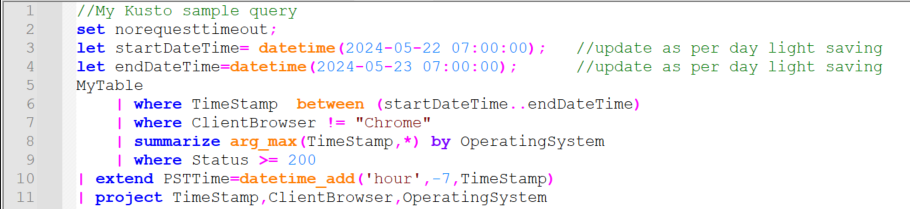
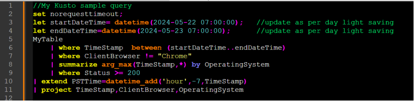
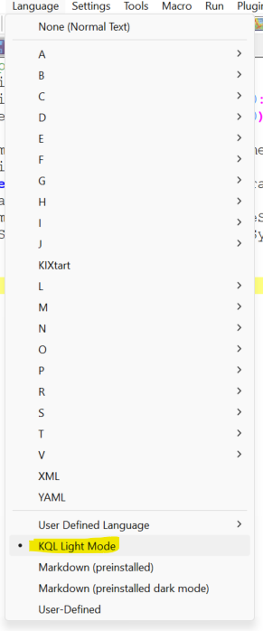

# Kusto Notepad++ Language
Syntax highlighting in notepad++ for Kusto Query Language (KQL).

Light Mode

Dark Mode

Language Selection 

## How to use it
1. Open Notepad++, in menu select Language -> User Defined Language -> Define your language.
2. In the dialog, select Import and then select **KQLNpp_LightMode.xml** or **KQLNpp_DarkMode.xml**.
3. Restart Notepad++.
4. The new language slection (Kusto) should be now available in Language menu (see screenshots).

## Making changes
1. Follow above steps to Import.
2. Select Language -> User Defined Language -> Define your language.
3. In dialog, select "Kusto" in "user language" dropdown.
4. Make changes to any of the four tabs (Folder & Default, Keywords List, Comment & Number, Operators & Delimiters).
5. Click on Export and save the file. 

## Contributing 
If you want to change anything that will be helpful to everyone or if I have missing anything, feel free to make changes and send a pull request. 
